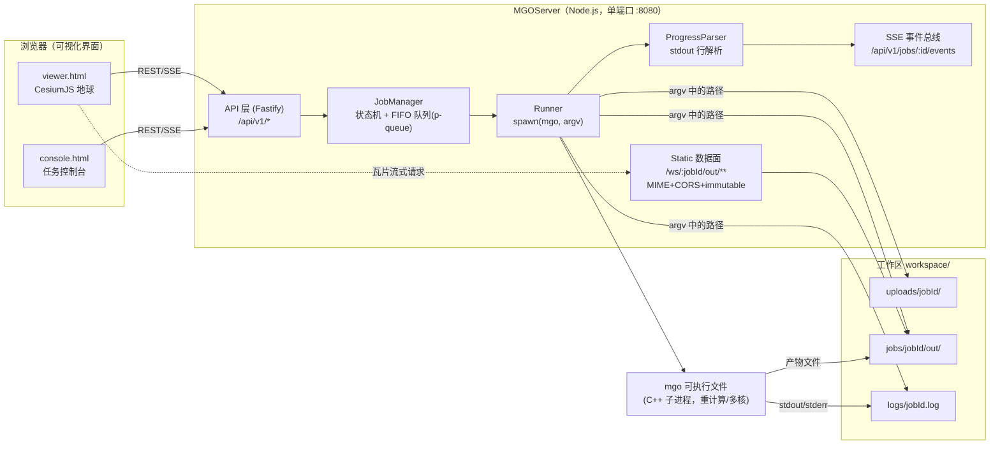
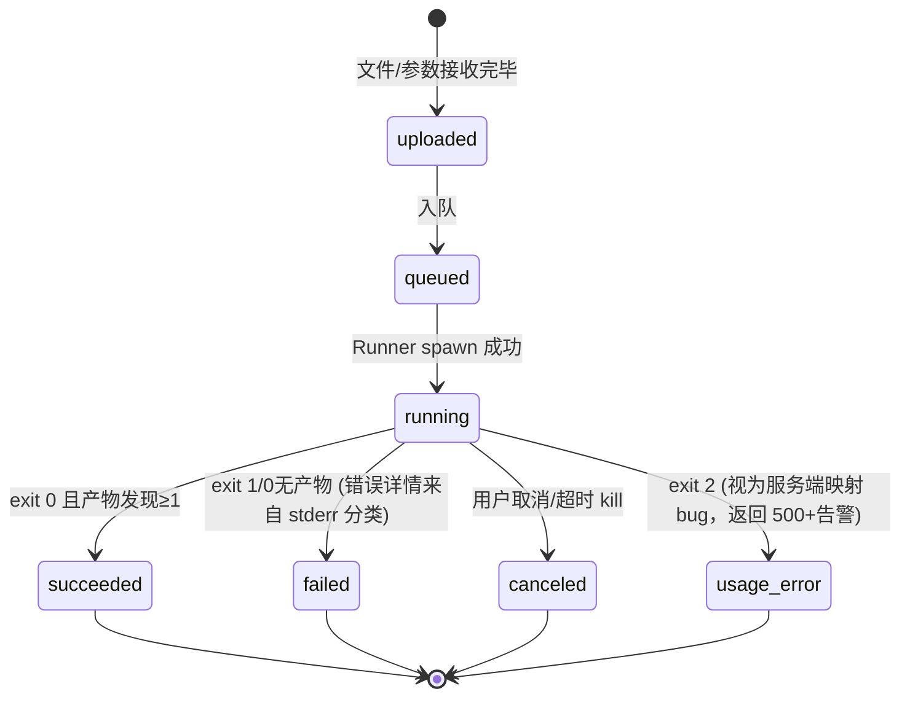
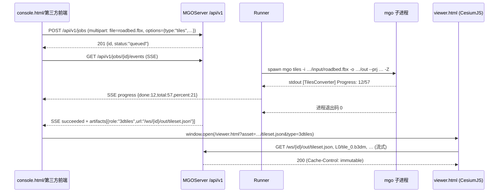

# MGO 可视化服务（MGOServer）设计方案

## —— Node.js 调用端口的可行性分析与技术设计

| 项目 | 内容 |
|------|------|
| 文档状态 | v0.3 — **M0~M3 已实现，并从 MGO 主仓库的 `mgo-server/` 子目录分离为独立仓库 `MGOServer`**（v0.1.0；`npm test` 53 项 + Chromium 页面级 25 步全通过，真实 `MGOConsole` 端到端转换验证通过）。本文档保留设计期原貌：§5.3 的目录树与部分文件名为**设计稿**，交付后的实际布局见 §5.3.1。跨仓库契约 = mgo stdout 的英文进度协议（§8） |
| 日期 | 2025-08 |
| 关联组件 | MGOConsole（mgo v1.0.0）、TilesConverter、TerrainConverter、DOMConverter、GeoJSONConverter、OSGBConverter |
| 决策前提 | 渲染引擎 = **CesiumJS**；服务技术栈 = **Node.js**；本轮交付 = 可行性分析 + 设计方案（不含实现） |

---

## 1. 背景与目标

MGO 目前是纯命令行（CLI）工具链：本地执行 `mgo tiles|terrain|image|geojson|mesh|osgb` 完成"模型/DEM/DOM → Cesium 可流式加载格式"的转换。数据要上地球仪，用户需要：装工具、记参数、手动起一个静态服务器、手写 Cesium 加载页。

本方案为 MGO 增加一个 **面向可视化界面的调用端口**（以下简称 MGOServer / 服务），定义为：

1. **控制面（API 端口）**：一组 HTTP REST + SSE 接口，供可视化前端（本方案自带的 viewer 或第三方 Web 平台）提交数据处理任务、查询进度、获取结果清单；
2. **数据面（静态端口）**：同一端口托管任务产物（`tileset.json`/`.b3dm`/`.terrain`/`layer.json`/影像瓦片/GeoJSON），供 CesiumJS 直接以 URL 流式加载；
3. **渲染端**：内嵌一个基于 **CesiumJS** 的可视化页面，任务完成后一键在地球上渲染处理结果。

目标用户：数字孪生 / BIM+GIS 集成项目中的非 C++ 用户（GIS 工程师、Web 前端、交付人员），以及需要把 MGO 能力集成进已有 Web 平台的第三方前端。

### 非目标（本期不做）

- 多租户账号体系、计费、审计合规模块；
- 分布式任务调度（单机单进程为基线，扩展路线见 §13）；
- 对 CesiumJS 渲染效果本身做二次产品化（仅提供一个可参考的标准 viewer）。

---

## 2. 现状盘点（方案的事实依据）

以下均来自仓库代码/文档的核实结论，是可行性判断的基础：

| # | 事实 | 出处 | 对设计的意义 |
|---|------|------|--------------|
| F1 | 全部转换能力已收敛为**单一 CLI 二进制 `mgo`**，6 个子命令、参数风格统一 | `MGOConsole/MGOConsole.cpp` | Node 以子进程方式包装即可覆盖 100% 能力，无需重写业务逻辑 |
| F2 | 统一退出码：`0` 成功 / `1` 转换失败 / `2` 用法错误 | `MGOConsole.cpp:387-389` | 任务终态可直接映射，判定简单可靠 |
| F3 | 各转换器向 stdout 输出**可解析的英文进度协议**：`[模块名] Progress: X/Y`，完成行 `[模块名] Done: …`（原中文行已在本轮统一切换为英文，避免跨终端编码歧义） | `TerrainConverter.cpp`、`TilesConverter.cpp`、`OSGBConverter.cpp`、`ImageTiler.cpp`、`OSGBReader.cpp` | 服务侧无需修改 C++ 业务逻辑即可实现逐瓦片粒度的进度上报（§8） |
| F4 | 错误诊断统一输出到 stderr，带 `[模块名]` 前缀 | 各模块 | 日志采集与错误分类有明确锚点 |
| F5 | 产物即 Cesium 原生格式：3D Tiles（b3dm+tileset.json）、quantized-mesh-1.0（`{z}/{x}/{y}.terrain`+`layer.json`，含 OctVertexNormals、availability/TMS-Y 均已按 Cesium 1.111 行为校准）、Web Mercator TMS 影像（含 `tilemapresource.xml`） | README、`TerrainLayerJson.cpp`、`QuantizedMeshEncoder.cpp` | 数据面无需任何转码/代理改写，静态托管即可被 CesiumJS 加载 |
| F6 | 维护者已用本地页面手工验证渲染：`Data/cesium_minimal.html`、`Data/cesium_debug.html`、`Data/cesium_debug_terrain.html`、`Data/dom_test.html`（使用 `TileMapServiceImageryProvider` 等）与自带的 `Data/cesium_1.111.js` | `Data/` 目录 | viewer 的加载代码路径已被实际验证，本方案只是将其产品化 |
| F7 | 坐标系约定由 C++ 侧闭环：glTF Y-up → CesiumJS 运行时自动 `Y_UP_TO_Z_UP`；根变换 ENU→ECEF；前端**不需要也不允许**再做轴向补偿 | `AxisMapper.h`、CLAUDE.md 坐标约定节 | 前端逻辑可保持极简；文档必须写明防止前端"好心"补偿（§9.3） |
| F8 | `mgo mesh` 的保存走 Assimp `Export(scene, extension, …)`，输出格式由文件扩展名驱动（`.obj`/`.glb`…） | `MeshGroupOptimizer.cpp` Save | 任务参数开放 `outputFormat`，`.glb` 产物可被 CesiumJS Model 直接渲染 |
| F9 | OSGBConverter 为可选编译（`MGO_WITH_OSG`，运行时 `HAS_OSGB_CONVERTER`） | CMakeLists.txt | 服务需要能力发现接口，按二进制实际能力裁剪 API（§6.2） |
| F10 | terrain 瓦片在 C++ 侧已是并行生成；OSGB/tiles 为单进程批处理 | TerrainConverter | 重计算发生在子进程内，Node 单线程不受影响；但**任务级并发必须限流**（§10.1） |
| F11 | Windows 侧 `mgo` 启动即 `chcp 65001`，进度行为 ASCII 英文文本 | `MGOConsole.cpp` main | Node 子进程 stdout 解码无歧义，进度协议跨终端/语言环境稳定（Windows GBK 路径转换在 CLI 内部已处理） |
| F12 | 已知输入限制：`mgo image/terrain` 目前仅支持条带式（striped）GeoTIFF；OSGB 输入是**目录树**（`metadata.xml` + `Tile_*`） | README 注记 | 上传协议与校验规则需要针对目录型输入设计（§6.3.6） |
| F13 | 本机开发环境 Node v22.23.2 / npm 10.9.8；仓库尚无 `docs/`、无任何服务代码 | 环境探测 | 新增 `mgo-server/` 目录零冲突；CI 可并行新增 Node job |

---

## 3. 需求定义

### 3.1 核心用例

```
UC1  上传 FBX/OBJ → 配准（7param/anchor/multipos）→ 3D Tiles → CesiumJS 查看
UC2  上传 GeoTIFF DEM → quantized-mesh 地形 → CesiumJS 地形层查看
UC3  上传 DOM 正射影像 → TMS 瓦片 → CesiumJS 影像层叠加
UC4  上传 GeoJSON（投影坐标）→ 转 EPSG:4326 → CesiumJS 矢量层查看
UC5  上传 OSGB 目录（zip）→ 3D Tiles → CesiumJS 查看（需 OSG 构建）
UC6  上传模型 → 简化+投影（mesh 子命令）→ 下载 .glb/.obj（.glb 可直接渲染）
UC7  第三方前端只调用 API + 取产物 URL，用自家 CesiumJS 页面渲染
```

### 3.2 约束

- 单机部署为主（Windows Server 与 Linux 均需支持——测绘行业常见 Windows 环境）；
- 服务进程与 mgo 二进制同机（大文件场景避免上传，支持"服务器本地路径"直读模式）；
- 不改 C++ 业务代码为硬约束（演进期例外见 §13）；
- 渲染引擎锁定 CesiumJS（自托管，不依赖 Cesium ion 外网）。

---

## 4. 可行性分析

### 4.1 渲染侧兼容度：★★★★★（已天然成立）

MGO 的输出格式就是为 Cesium 设计的：3D Tiles 1.0、quantized-mesh-1.0（且解码器行为已按 **Cesium 1.111 实测**逐项校准——固定 uint16 u/v 编码、availability、TMS-Y、OctVertexNormals、扩展长度小端序等，见 `TerrainLayerJson.cpp` / `QuantizedMeshEncoder.cpp` 注释）。`Data/cesium_*.html` 证明"静态托管 + CesiumJS fromUrl"路径实际可跑通。
**结论：渲染端不存在格式障碍，剩下的全部工作量在"服务化 + 前端产品化"。**

### 4.2 调用侧集成度：★★★★★（CLI 即端口）

- 能力入口单一（F1），子命令↔任务类型一一对应，参数是扁平的 `--flag value`，天然适合"JSON → argv 数组"的声明式映射（附录 A），**不经 shell 拼接，杜绝命令注入**；
- 退出码三元组（F2）+ 带前缀进度/错误行（F3/F4），任务状态机与进度解析无需猜测。

### 4.3 技术路线对比

| 路线 | 描述 | 优点 | 缺点 | 判定 |
|------|------|------|------|------|
| **A. Node.js 服务 + 子进程包装 mgo CLI**（选定） | Fastify 起 HTTP 服务，`child_process.spawn` 调用 mgo，解析 stdout 驱动进度；同端口托管静态产物 | 零 C++ 改动；进程隔离（崩溃/OOM 不波及服务，可 kill 可限流）；与 CLI 行为完全一致，回归测试体系复用；开发迭代最快 | 每次任务有一次进程启动开销（对秒-分钟级任务可忽略）；进度粒度受限于 F3 协议 | ✅ **采纳**（用户指定 Node 栈，且为本场景最优） |
| B. Node.js + native addon（node-addon-api 直接链 MGO 共享库） | N-API 封装 CTilesConverter 等到 V8 进程内调用 | 无子进程开销；理论上可拿库内实时回调 | 需为 7 个模块维护跨平台 N-API 绑定 + vcpkg/CMake/Node-gyp 三套构建体系融合；一个段错误拖垮整个服务；开发/调试成本数倍 | ❌ 本期否决；列为演进项（§13.1） |
| C. C++ 内置 HTTP 服务（MGOServer 模块 + cpp-httplib） | 在 CMake 里新增服务可执行 | 单二进制交付 | 与用户 Node.js 决策不符；任务管理/SSE/上传生态在 C++ 侧实现成本高 | ❌ 尊重选型 |
| D. Python (FastAPI) 包装 CLI | 同 A 但换 Python | 生态成熟 | 同 A 但栈不同；用户已选定 Node | ❌ 不选 |

### 4.4 关键工程问题核查

| 问题 | 结论 |
|------|------|
| Node 事件循环是否会被长任务阻塞？ | 否。计算全部在子进程；服务侧仅做 IO 与状态管理 |
| 大瓦片量静态文件（数十万小文件）Node 直读性能？ | 可行（`stream.pipeline` + `Cache-Control: immutable` + ETag）；生产可挂 Nginx `X-Accel-Redirect` 卸载，API 仍走 Node（§11.3） |
| CesiumJS 离线部署？ | 自托管 Cesium（npm `cesium` 包 Build 产物或复用 `Data/cesium_1.111.js` + Widgets/Workers），默认底图可指向本服务托管的影像；无 ion token 也可运行（§9.1） |
| Windows/Linux 一致？ | Node、Fastify、静态服务、SSE 全跨平台；子进程 kill 语义差异用 `tree-kill` 抹平；中文路径由 CLI 内部 GBK↔UTF-8 转换兜底（CLAUDE.md） |
| 磁盘增长？ | 任务目录 TTL 清理 + 提交前配额检查（§10.3） |

### 4.5 风险清单与缓解

| 风险 | 等级 | 缓解措施 |
|------|------|----------|
| 进度协议为文本行（英文 `Progress:`/`Done:`），未来改动 CLI 输出可能破坏解析 | 中 | 解析器集中一处 + 容错（解析失败退化为"文件数估算/仅状态"模式）；演进期给 CLI 加 `--progress-json`（§13.2）并以 JSONL 为优先协议 |
| OSGB 输入是目录树，浏览器只能上传文件 | 中 | 三通道：① zip 上传+服务端安全解压（防 zip-slip）；② 同机 `inputPath` 本地路径直读（默认推荐）；③ 后续支持对象存储导入 |
| 大文件（多 GB GeoTIFF/FBX）上传超时 | 中 | 上传大小可配上限 + 断点续传列为演进项（§13.4）；同机模式绕开上传 |
| 单任务内存峰值高（大场景） | 中 | 任务级并发默认 1；队列上限；OOM 退避重跑策略 |
| 静态产物目录被路径穿越访问 | 高 | 仅按 job-id 白名单映射 + `realpath` 前缀校验，禁止任意路径（§10.4） |
| `mgo image` 不支持 tiled GeoTIFF 造成"任务成功但结果错误"错觉 | 低 | 提交时服务端预探测 TIF 布局（GDAL 信息可在 Node 侧用轻量解析，或直接快速失败转 stderr 信息），前端给出明确文案 |
| CesiumJS 版本与 quantized-mesh 解码行为强耦合（当前按 1.111 校准） | 中 | viewer 锁定与 `Data/cesium_1.111.js` 同源版本；升级需跑 `Script/Test/*_verify.py` + terrain 集成页回归 |
| 无鉴权裸奔被公网滥用 | 高 | 默认绑定 `127.0.0.1`；对外配 `MGO_IP_WHITELIST` + HTTPS 反代（§10.4）；隧道/反代透传真实客户端 IP 后白名单才有效；文档明示"内网工具"定位 |

### 4.6 可行性结论

**结论：高度可行，风险可控，无需修改任何 C++ 生产代码。** 判定依据：渲染兼容（F5/F6/F7）与调用集成（F1–F4）两个最难的点已被仓库现状天然满足；Node 包装层是纯胶水工程；其余为常规服务化问题（上传、并发、磁盘、安全），均有成熟套路。预计 **约 16 人日**（§12）可交付 v1。

---

## 5. 总体设计

### 5.1 架构



设计要点：

- **控制面与数据面同端口**（8080，可配），部署最简；数据面可被反向代理旁路接管；
- **mgo 子进程是唯一计算体**：服务升级、任务崩溃互不影响；
- **产物以"文件即 API"方式暴露**：第三方前端（UC7）拿到 URL 就能接自己的 CesiumJS。

### 5.2 组件职责

| 组件 | 职责 | 关键依赖 |
|------|------|----------|
| API 层 | 路由、鉴权、参数校验（zod）、错误封装 | Fastify 5 |
| JobManager | 任务生命周期、状态机、注册表（内存 Map + 可选 SQLite 持久）、取消 | p-queue、better-sqlite3(可选) |
| Runner | 构建 argv（附录 A 映射表驱动）、spawn、超时守护、kill（tree-kill） | node:child_process |
| ProgressParser | 正则解析 `[模块] Progress: X/Y` → 归一化 progress 对象；stderr 分类归档 | node:readline |
| Static 数据面 | 产物托管：MIME 表、CORS、缓存、路径防穿越 | @fastify/static |
| Viewer | CesiumJS 渲染页（3D Tiles / terrain / TMS / GeoJSON / glTF 五类图层） | cesium（自托管） |
| Console | 上传表单 + 任务列表 + 进度条 + "在地球上查看"跳转 | 原生 ES Module，不引框架 |

### 5.3 仓库与目录布局

```
MGO/
├── mgo-server/                 # ★ 新增：独立 Node 工程，不进 CMake
│   ├── package.json            # engines: node >= 20
│   ├── .env.example
│   ├── src/
│   │   ├── server.js           # 入口：装配 Fastify + 插件 + 路由
│   │   ├── config.js           # 端口/工作区/限额/mgo 路径/IP 白名单
│   │   ├── jobs/
│   │   │   ├── manager.js      # 状态机、队列、注册表
│   │   │   ├── runner.js       # spawn/取消/超时
│   │   │   ├── argv.js         # 类型化 JSON → mgo argv（附录 A 表驱动）
│   │   │   ├── progress.js     # 进度协议解析
│   │   │   └── artifacts.js    # 成功后产物发现（扫描已知文件名/扩展）
│   │   ├── api/
│   │   │   ├── jobs.routes.js
│   │   │   ├── static.routes.js    # 数据面
│   │   │   └── schemas/            # zod：每任务类型一份
│   │   └── workspace.js        # 目录规范、TTL 清理、配额
│   ├── public/                 # 前端静态资源
│   │   ├── console.html        # 任务控制台
│   │   ├── viewer.html         # CesiumJS 查看器
│   │   └── cesium/             # 自托管 Cesium 1.111（Build：Workers/Widgets/assets）
│   └── test/                   # node:test；含进度行解析黄金样例（从真实 CLI 日志截取）
├── docs/
│   └── VISUALIZATION_SERVICE_DESIGN.md   # 本文档
└── (既有 C++ 模块不变)
```

### 5.3.1 交付后的实际布局（独立仓库）

服务不再是 MGO 仓库的子目录，而是与其**同级**的独立仓库；运行时只依赖 MGO 编译出的
`MGOConsole` 可执行文件（默认探测 `../MGO/build/bin/MGOConsole`，可用 `MGO_BINARY` 指定）：

```
coding/
├── MGO/                      # C++ 工具链（被驱动方，产物 build/bin/MGOConsole）
└── MGOServer/                # ★ 本仓库
    ├── package.json          # engines: node >= 20
    ├── .env.example          # 由 src/dotenv.js 自动加载（无需 dotenv 依赖）
    ├── deploy/               # systemd unit + EnvironmentFile 模板
    ├── docs/VISUALIZATION_SERVICE_DESIGN.md
    ├── src/
    │   ├── server.js         # 入口：装配 Fastify + 全局 IP 门禁 + 静态托管
    │   ├── config.js         # .env/端口/工作区/限额/mgo 路径/白名单/trustProxy
    │   ├── dotenv.js         # 零依赖 .env 解析（真实 env 优先于文件）
    │   ├── ipmatch.js        # IP/CIDR 匹配与白名单合并
    │   ├── localpath.js  mgo.js  zipextract.js
    │   ├── jobs/             # manager / runner / argv / progress / artifacts / schemas
    │   └── api/              # routes.js（控制面） + data-plane.js（/ws 产物）
    ├── public/               # console.html / viewer.html / whitelist.html (+ cesium/ 自托管，gitignore)
    ├── scripts/              # sync-cesium.mjs、generate-test-tif.py（地形上传样例夹具）
    ├── test/                 # node:test 单测 + e2e（fake-mgo 替身）
    └── ui-test.mjs           # Playwright 页面级 25 步（需服务在跑）
```

与设计稿的差异：`api/jobs.routes.js` + `api/static.routes.js` 合并为 `api/routes.js` +
`api/data-plane.js`；`workspace.js` 的职责并入 `jobs/manager.js`；`schemas/` 收敛为单文件
`jobs/schemas.js`（zod，按任务类型分段）；新增设计稿未列的 `whitelist.html`、`dotenv.js`、
`deploy/`。

工作区（运行时数据，gitignore）：

```
workspace/
└── jobs/<jobId>/
    ├── job.json        # 任务快照（重启恢复用）
    ├── input/          # 上传件（原始文件名 sanitize 后）
    ├── out/            # mgo -o 指向此目录（mesh 类为 out/<file>.glb）
    └── run.log         # stdout+stderr 合并落盘（SSE/tail 的数据源）
```

### 5.4 任务状态机



### 5.5 端到端时序（UC1 为例）



---

## 6. API 设计（调用端口定义）

### 6.1 通用约定

| 项 | 约定 |
|----|------|
| 监听 | 默认 `127.0.0.1:8080`（`MGO_HOST`/`MGO_PORT` 可配）；对外发布必须走 HTTPS 反代（§10.4） |
| 控制面前缀 | `/api/v1`；数据面前缀 `/ws`；前端静态 `/` |
| 内容类型 | 请求/响应均 JSON（上传为 `multipart/form-data`）；日期为 ISO-8601 UTC |
| job id | UUID v7（时间有序，便于列表分页） |
| 鉴权 | 写操作 IP 白名单：`127.0.0.1`/`::1`（本机）恒允许，`MGO_IP_WHITELIST`（IP/CIDR）与运行时本机 `POST /api/v1/whitelist`（持久化 `workspace/whitelist.json`）追加；白名单管理接口仅回环可调（防锁死）；读接口与 `/ws` 匿名只读 |
| 错误信封 | `{ "error": { "code": "VALIDATION", "message": "…", "details": […], "requestId": "…" } }`，HTTP 码语义化：400/404/409/413/422/429/500 |
| CORS | 默认同源；`MGO_CORS_ORIGIN` 白名单，`/ws/**` 附 `Access-Control-Allow-Origin`（CesiumJS 跨域加载必需） |

### 6.2 端点总表

| 方法 | 路径 | 说明 |
|------|------|------|
| GET | `/api/v1/health` | 存活探针：`{status, uptime, version, mgo:{path, version, hasOsgb}}` |
| GET | `/api/v1/capabilities` | 能力发现：子命令清单、`osgb` 是否可用（F9）、限额参数 |
| POST | `/api/v1/jobs` | 创建任务（multipart：`file`+`options`；或 JSON：`inputPath`/`inputUrl` 直读模式） |
| GET | `/api/v1/jobs` | 任务列表（`?type=&status=&cursor=&limit=`） |
| GET | `/api/v1/jobs/{id}` | 任务详情（含 progress、artifacts、error） |
| GET | `/api/v1/jobs/{id}/events` | **SSE** 进度/状态事件流 |
| GET | `/api/v1/jobs/{id}/log?tail=200` | 原始日志尾读（排障） |
| POST | `/api/v1/jobs/{id}/cancel` | 取消排队/运行中任务 |
| DELETE | `/api/v1/jobs/{id}` | 删除任务及其工作区 |
| GET | `/api/v1/jobs/{id}/artifacts` | 产物清单（含 Cesium 接入 URL 与推荐图层类型） |
| GET | `/ws/{jobId}/out/**` | **数据面**：产物静态资源（CesiumJS 直接消费） |
| GET | `/viewer.html?asset={url}&type={3dtiles\|terrain\|imagery\|geojson\|model}` | 打开渲染页 |
| GET | `/console.html` | 任务控制台 |

### 6.3 创建任务

#### 6.3.1 两种提交形态

```
POST /api/v1/jobs            Content-Type: multipart/form-data
  file:      <二进制上传>            # 单文件类：fbx/obj/tif/geojson/glTF…
  options:   {"type":"tiles", …}     # JSON 字符串（见各类型 schema）
```

```
POST /api/v1/jobs            Content-Type: application/json     # 同机直读模式
  { "type": "tiles", "inputPath": "D:/proj/roadbed.fbx", …params }
```

`inputPath` 与 `file` 二选一；`inputPath` 默认关闭（`MGO_ALLOW_LOCAL_PATH=1` 才启用），并限制在 `MGO_ALLOWED_ROOTS` 白名单目录内（防任意文件读取）。

#### 6.3.2 公共参数对象（跨类型复用）

```jsonc
// simplify —— 映射 mgo 通用简化参数（README "Mesh Simplification"）
{ "simplify": { "error": 0.01, "normalWeight": 0.1, "threshold": 0.1,
                "lockBorder": true, "localError": false } }

// georef —— 映射 --georef/--7p/--cps/--fit-order/--auto-crs/--offset
{ "georef": { "mode": "7param",                       // 7param | multipos | anchor
              "sevenParameter": [0,0,0,0,0,0,0],       // m(米) r(角秒) s(ppm)
              "controlPointsCsv": "sx,sy,sz,tx,ty,tz\n…",  // 或上传 cp.csv 文件
              "fitOrder": 1, "autoCrs": false,
              "offset": [0,0,0] } }

// proj —— 映射 --prj：三选一
{ "proj": { "crs": "EPSG:4547" } }            // 内联 EPSG/WKT/+proj
{ "proj": { "prjFile": "<上传的 .prj>" } }     // 上传 .prj
{ "proj": { "prjPath": "D:/data/cgcs2000.prj" } } # 直读模式
```

#### 6.3.3 `type: "tiles"`（→ `mgo tiles`）

```jsonc
{
  "type": "tiles",
  "zUp": true,                 // -Z
  "rootGeometricError": 500,   // -e
  "tileGeometricError": 50,    // -t
  "refine": "ADD",             // -r ADD|REPLACE
  "origin": [445000, 3260000, 0],   // --origin
  "minBlockDistance": 100,     // --min-block
  "maxLod": 5,                 // --max-lod
  "proj": { "$ref": "proj" },
  "georef": { "$ref": "georef" },
  "simplify": { "$ref": "simplify" }
}
```

成功产物：`out/tileset.json`（role=`3dtiles`）。

#### 6.3.4 `type: "terrain"`（→ `mgo terrain`）

```jsonc
{ "type": "terrain",
  "maxLod": null,              // 缺省按像素尺寸自动
  "samplesPerTile": 65,        // --samples，必须奇数（校验器强制）
  "normals": true,             // false → --no-normals
  "proj": {…}, "georef": {…}, "simplify": {…} }
```

产物：`out/layer.json`（role=`terrain`）+ `{z}/{x}/{y}.terrain`。

#### 6.3.5 `type: "image"`（→ `mgo image`）

```jsonc
{ "type": "image", "proj": {…} }
```

产物：`out/tilemapresource.xml` + `layer.json`（role=`imagery`）。

#### 6.3.6 `type: "osgb"`（→ `mgo osgb`）

输入三通道（F12）：`inputPath` 指向含 `metadata.xml` 的目录（推荐）；或上传 `.zip`（服务端安全解压，逐条校验解压路径前缀）；上传散文件不支持。
参数：`{ "type":"osgb", "enu": [lat, lon, h], "origin":[…], "maxLod": N, proj/georef/simplify 同 public 对象 }`。
产物：`out/tileset.json`（role=`3dtiles`）。

#### 6.3.7 `type: "geojson"` / `type: "mesh"`

```jsonc
{ "type": "geojson", "sourceCrs": "EPSG:4547", "targetCrs": "EPSG:4326", "pretty": true }
// 产物 out/xxx.geojson（role=geojson）

{ "type": "mesh", "outputFormat": "glb",      // obj|glb|fbx…（F8，扩展名驱动）
  "coordMode": "original",                     // -C original|left
  "proj": {…}, "georef": {…}, "simplify": {…} }
// 产物 out/model.glb（role=model；glb 可被 viewer 直接渲染）
```

### 6.4 任务对象与事件

```jsonc
// GET /api/v1/jobs/{id} 响应
{
  "id": "0190a8b2-6f3e-7000-…",
  "type": "tiles",
  "status": "running",                 // uploaded|queued|running|succeeded|failed|canceled|usage_error
  "progress": { "phase": "tiles", "done": 12, "total": 57, "percent": 21,
                "source": "cli-stdout" },   // cli-stdout|file-scan|none
  "createdAt": "…", "startedAt": "…", "finishedAt": null,
  "exitCode": null,
  "error": null,                        // {code, message, logTail:[…]}
  "artifacts": [],
  "viewerUrl": null                     // 成功后注入 "/viewer.html?asset=…&type=3dtiles"
}
```

SSE 事件流（`/events`）：

```
event: status     data: {"status":"running"}
event: progress   data: {"done":12,"total":57,"percent":21,"phase":"tiles","message":"[TilesConverter] Progress: 12/57"}
event: log        data: {"line":"[TilesConverter] Warning: …","stream":"stderr"}
event: status     data: {"status":"succeeded","artifacts":[…],"viewerUrl":"…"}
```

约定：SSE 支持 `Last-Event-ID`（事件落盘 `run.log` 附带序号，断线可重放）；轮询 `GET /jobs/{id}` 作为降级通道。

### 6.5 产物发现规则（artifacts.js）

成功后扫描 `out/`，按固定规则产出清单（不信任任意文件枚举）：

| 探测目标 | role | Cesium 图层类型 |
|----------|------|-----------------|
| `tileset.json`（含 `content.json` 兼容名） | `3dtiles` | `Cesium3DTileset` |
| `layer.json` 且同目录存在 `*.terrain` | `terrain` | `CesiumTerrainProvider` |
| `layer.json`/`tilemapresource.xml` 且同目录存在 `*.png` | `imagery` | `TileMapServiceImageryProvider` |
| `*.geojson` | `geojson` | `GeoJsonDataSource` |
| `*.glb` | `model` | `Model.fromGltf` |

---

## 7. 数据面设计（CesiumJS 静态托管）

| 资源 | Content-Type | 其他头 |
|------|--------------|--------|
| `tileset.json` / `layer.json` | `application/json` | 可较短缓存（60s，任务可能重跑） |
| `*.b3dm` / `*.terrain` / `*.glb` | `application/octet-stream` | `Cache-Control: public, max-age=31536000, immutable` |
| `*.png` / `*.jpg` | `image/png` / `image/jpeg` | 同上 immutable + ETag |
| `*.geojson` | `application/geo+json` | 60s |
| `tilemapresource.xml` | `application/xml` | immutable |

- `/ws/**` 恒定附 `Access-Control-Allow-Origin`（来自配置白名单或 `*`）——CesiumJS 的 provider 请求是 `crossOrigin` 匿名 fetch，缺 CORS 会静默黑球；
- terrain 缺瓦返回 `404` 即可（Cesium 按 `layer.json` 的 `available` 树请求，不会乱请求——该行为在 `TerrainLayerJson.cpp` 已针对 1.111 校准），但**不能**返回 200+HTML 兜底页；
- 提供 `HEAD` 与 Range（Node 静态栈原生支持）；`index.html` 类兜底路由必须排除 `/ws` 前缀。

---

## 8. 进度解析设计

集中式行解析器（`progress.js`），对 F3 协议逐行匹配：

```js
const RE_PROGRESS = /^\[(TerrainConverter|TilesConverter|OSGBConverter|OSGBReader|ImageTiler)\]\s*Progress:\s*(\d+)\/(\d+)/;
const RE_DONE     = /^\[(TerrainConverter|TilesConverter|OSGBConverter|OSGBReader|ImageTiler)\]\s*Done:\s*(.*)/;
const RE_FAIL     = /^\[(TerrainConverter|TilesConverter|OSGBConverter|ImageTiler)\]\s*(Failed|.*failed|.*失败).*$/;
```

归一化：`percent = total ? round(100*done/total) : 0`。注意事项（按代码实况）：

1. **ImageTiler 的 X/Y 是"层级/总层级"粒度**（`ImageTiler.cpp:507` 用 `levelIdx`），百分比是粗粒度——UI 文案显示"第 X/Y 级"，不伪装瓦片级精度；
2. TilesConverter 进度行在瓦片写盘阶段输出，LOD 聚合阶段（无进度行）用 `phase:"building-hierarchy"` 假性心跳（每 5s 一条 SSE log 事件），避免"卡死"观感；
3. 解析失败**绝不**使任务失败——退化为 `source:"file-scan"`（每 3s 统计 `out/` 文件数）或 `source:"none"`，只保状态正确；
4. 黄金样例测试：从真实运行日志截取若干 stdout 片段入库 `test/fixtures/`，防协议漂移（对应 §4.5 风险 1）。

---

## 9. CesiumJS 前端渲染方案

### 9.1 部署与版本

- **自托管 Cesium，锁定 1.111**（与仓库解码器校准版本一致，F5/F6）：从 npm `cesium@1.111` 构建产物或直接把 `Data/cesium_1.111.js` 与 `Widgets/Workers/assets` 拷入 `public/cesium/`；页面设 `window.CESIUM_BASE_URL='/cesium/'`；
- 不依赖 Cesium ion：`Viewer` 关闭默认地形/影像 ion 服务，底图用本服务托管影像或可选的离线 TileMap 资源；`requestRenderMode: true` 降低挂机开销；
- 升级 Cesium 版本必须回归：`Script/Test/full_spec_verify.py`、`geometric_verify.py` + `viewer.html` 手工加载 terrain/tiles 各一次。

### 9.2 viewer.html：五类图层加载器

```js
// role → 加载函数（与 §6.5 一一对应）
const LOADERS = {
  '3dtiles': async (url) => {
    const ts = await Cesium.Cesium3DTileset.fromUrl(url);   // MGO 已写出正确 root transform
    return viewer.scene.primitives.add(ts);
  },
  'terrain': async (url) => {          // url 指向 out/ 目录（layer.json 所在处）
    const tp = await Cesium.CesiumTerrainProvider.fromUrl(url, {
      requestVertexNormals: true,       // MGO 默认编码 OctVertexNormals
      requestWaterMask: false });
    viewer.scene.setTerrain(new Cesium.Terrain(tp));        // 或 terrainProvider = tp
    return tp;
  },
  'imagery': async (url) => {          // TMS 影像（Data/dom_test.html 同款）
    const ip = await Cesium.TileMapServiceImageryProvider.fromUrl(url + '/tilemapresource.xml');
    return viewer.imageryLayers.addImageryProvider(ip);
  },
  'geojson': async (url) => Cesium.GeoJsonDataSource.load(url, { clampToGround: true }),
  'model':   async (url) =>            // mesh 任务的 .glb 产物（局部模型，非地理化）
    viewer.entities.add({
      position: viewer.camera.position,          // 默认放在相机前，UI 允许改经纬度
      orientation: Cesium.Transforms.headingPitchRollQuaternion(viewer.camera),
      model: { uri: url, scale: 1.0 },
    }),
};
// 注：需要地理化定位的模型请走 type:"tiles"（3D Tiles 管线），model 图层仅用于快速预览简化结果。
```

页面行为：读 `?asset=&type=` 自动加载；图层面板可叠加多产物（例如 terrain + imagery + tiles 同屏，正是 M1 交付验收视图）；状态栏显示 `tileset.debugShowBoundingVolume` 调试开关；提供"复制图层配置 JSON"按钮方便第三方集成。

### 9.3 坐标约定红线（必须写进前端文档）

- CesiumJS 对 glTF/b3dm 自动施加 `Y_UP_TO_Z_UP`，MGO 的 tileset `transform` 与包围盒已按 **Cesium Z-up 系**写出（F7）——前端**不得**再给 tileset 套任何旋转/取反矩阵；
- terrain 的 `{y}` 命名与 availability 已按 Cesium 1.111 的 TMS-Y 行为校准，前端只需要目录根 URL；
- 若发现"北方向整体镜像/偏移"类现象，先怀疑 Cesium 版本 ≠ 1.111 或 `--7p`/`--cps` 参数错误，而不是改前端坐标。

---

## 10. 非功能与安全设计

### 10.1 并发与资源

- `MAX_CONCURRENT_JOBS` 默认 **1**（terrain 在 C++ 侧已多线程并行，任务级再并发极易 IO/CPU 互踩）；可配 2-4（按核数）；
- 队列上限 `QUEUE_MAX`（默认 100），超限返回 `429 + Retry-After`；
- 单任务超时 `MGO_JOB_TIMEOUT_S`（默认 4h，按类型可覆写），超时 → kill → `canceled(timeout)`；
- Windows kill 用 `taskkill /T /F /PID`（tree-kill），Linux 用 SIGTERM→10s→SIGKILL。

### 10.2 可观测性

- JSON Lines 结构化访问日志 + 任务审计行（submit/start/progress%/end/exit）；
- `/metrics`（可选 `prom-client`）：任务计数/时长直方图、队列深度、磁盘余量、SSE 连接数；
- 启动自检：探测 `mgo` 可执行文件（`--version`、`mgo help` 判定 `hasOsgb`），失败则拒绝启动并报错。

### 10.3 磁盘治理

- 提交前检查 `workspace` 所在盘剩余空间 > `MGO_MIN_FREE_GB`（默认 10）；
- TTL：`succeeded/failed/canceled` 超 `MGO_TTL_DAYS`（默认 7）后由定时清理器删除任务目录（先 `queued/running` 保护检查）；
- `DELETE /jobs/{id}` 立即回收。

### 10.4 安全

| 面 | 措施 |
|----|------|
| 命令注入 | 永远 `spawn(binary, argv[])`，绝不 `exec` 拼串；参数值来自 zod 白名单 schema |
| 路径穿越 | 上传文件名 `basename` 化；`/ws/{jobId}/**` 解析后 `realpath` 必须位于 `workspace/jobs/{jobId}/out`；`inputPath` 限 `MGO_ALLOWED_ROOTS` |
| zip 解压 | 逐条 entry 校验解析路径前缀；拒绝绝对路径/`..`；解压总大小与文件数上限（防 zip-bomb） |
| 上传 | 单文件大小上限（默认 2 GiB，可配）；扩展名按任务类型白名单；`multipart` 流式落盘（busboy），不整读内存 |
| 访问控制 | 默认绑定回环；写接口（POST/DELETE/cancel）IP 白名单强制（本机恒允许）；`/ws` 只读匿名；CORS 白名单 |
| 依赖 | `npm audit` 入 CI；锁文件提交 |

---

## 11. 部署方案

### 11.1 单机直跑（开发/内网）

```bash
# 假设 MGO 已构建到 ../MGO/build/bin/MGOConsole，Node ≥ 20
cd MGOServer && npm ci
MGO_BINARY=../MGO/build/bin/MGOConsole MGO_PORT=8080 node src/server.js
# 或 cp .env.example .env 后 npm start —— .env 由 src/config.js 自动加载
```

### 11.2 服务化

- Linux：systemd unit（已交付 `deploy/mgo-server.service`：`Restart=always` + `EnvironmentFile=/etc/mgo-server.env` + 工作区 `ReadWritePaths`）。缺了它，机器重启后服务不会回来，而"白名单没生效"往往是端口根本没监听的假象；
- Windows：NSSM 注册为服务（测绘机房常见形态），或与 MGO 一起绿色打包（`pkg`/SEA 可选）。

### 11.3 反向代理（可选，公网/团队环境）

Nginx/IIS 终结 HTTPS；`/api` 转 Node；`/ws` 二选一：
1. 简单：仍转 Node；
2. 高性能：Nginx `alias` 直出 workspace + `X-Accel-Redirect` 由 Node 签发内部重定向（保留鉴权的同时让静态 IO 旁路 Node）。

反代必须 `proxy_set_header X-Forwarded-For $proxy_add_x_forwarded_for;`，并保持服务侧
`MGO_TRUST_PROXY=loopback`（默认）：只信任本机对端送来的 XFF。若反代与 Node 不同机，
改为跳数或网段。**不可取 `true`**——那会让任意远程客户端伪造 `X-Forwarded-For: 127.0.0.1`，
既越过全局门禁，又能调用仅回环可调的 `/api/v1/whitelist` 自助加白。

### 11.4 Docker（多阶段）

```dockerfile
FROM mgo-builder AS mgo   # vcpkg + cmake 构建 mgo（层缓存，构建一次）
FROM node:20-slim
COPY --from=mgo /out/bin/MGOConsole /usr/local/bin/mgo   # 或挂载 ../MGO 产物 + MGO_BINARY
COPY . /app ; WORKDIR /app ; RUN npm ci --omit=dev
EXPOSE 8080 ; VOLUME /app/workspace
CMD ["node", "src/server.js"]
```

注意：镜像内 PROJ 的 `proj.db` 与 GDAL 数据须随 vcpkg 安装目录一并拷入（现有 CLI 容器化如有既有做法则复用）。

### 11.5 CI

独立仓库自带 `.github/workflows/ci.yml`：`npm ci && npm test`（Node 20 / 22 双矩阵），
覆盖进度解析黄金样例、argv 映射快照、上传/路径穿越防护与白名单/配置用例；e2e 以
`test/fixtures/fake-mgo.sh` 顶替真实二进制，因此 CI 不需要 vcpkg/CMake 环境。
页面级 `npm run test:ui` 需 Chromium 与真实 `MGOConsole`，仍在本地跑。

---

## 12. 里程碑与工作量估算（1 名全栈 ≈ 16 人日）

| 里程碑 | 内容 | 验收 | 估时 | 状态 |
|--------|------|------|------|------|
| **M0 骨架** | Fastify + health/capabilities + jobs CRUD + Runner(spawn/kill/exit 映射) + 进度解析 + SSE | `curl` 提交 terrain 合成样例（`Script/Test/test_terrain.tif`），SSE 看到 `x/y` 进度直到 succeeded | 3d | ✅ 已实现 |
| **M1 数据面** | multipart 上传、workspace 规范、artifacts 发现、`/ws` 静态 + MIME/CORS/immutable、TTL 清理 | 产物可被 `curl` 拉取且头部正确；tiles/terrain/image/geojson 四链路通 | 4d | ✅ 已实现 |
| **M2 前端** | viewer.html（五类加载器，自托管 Cesium 1.111）+ console.html（上传表单/任务列表/进度条） | UC1–UC4 浏览器端全程可点；terrain+tiles 同屏 | 4d | ✅ 已实现（headless Chromium 23 项 UI 自动化验收通过；后续又完成一轮产品化改版：玻璃拟态 HUD、表单拖拽区、统计条、Toast、坐标读数、截图等） |
| **M3 加固** | 鉴权、限额/配额、zip 通道（OSGB）、错误信封完善、日志/metrics、部署件、文档 | §10 安全用例通过；OSGB zip → 3D Tiles 渲染（含 UC5） | 4d | ✅ 全部完成：IP 白名单门禁（本机恒允许 + 本机管理页）、限额/TTL/磁盘配额、OSGB zip 通道（yauzl 流式解压、防 zip-bomb、路径穿越 422）、metrics 端点、错误信封、文档 |
| （可选）M4 | inputPath 直读模式、Nginx 旁路、`--progress-json` C++ 小补丁 | — | 2d | ◐ inputPath 直读已提前实现（默认关闭，白名单根目录约束）；metrics 端点 `GET /api/v1/metrics` 已实现；mesh 配置 CSV（`-c`）上传通道已实现 |

依赖：无新增 C++ 依赖；Node 依赖仅 Fastify 生态 + cesium 静态资源。

---

## 13. 后续演进

1. **native addon 进程内调用（路线 B）**：若出现"秒级小任务高频提交"需求，用 `node-addon-api` 直链 `TilesConverter/TerrainConverter` 共享库换取真实库内回调——届时服务层协议不变，仅替换 Runner；
2. **`mgo --progress-json`**：C++ 侧加 10 行，输出 JSONL 事件（done/total/eta/bytes），Node 侧解析器优先走 JSON 通道，淘汰文本行正则；
3. **对象存储对接**：产物直传 S3/MinIO 并签发只读 URL，数据面出云；
4. **断点续传/大文件**：tus 协议或分片上传 API；
5. **切片服务合并**：`mgo` 输出若引入 glTF+DRACO/KTX2 与 `mesh`/`points` 3D Tiles 1.1 内容，viewer 加载器对应扩展（CesiumJS 原生支持）；
6. **多租户与配额**：接 OIDC/LDAP 后为每个租户独立 workspace 与限额。

---

## 附录 A：任务参数 ↔ mgo CLI 全量映射

| JSON 字段 | CLI flag | 适用类型 | 校验 |
|-----------|----------|----------|------|
| （`file` / `inputPath`） | `-i` | 全部 | 类型白名单：tiles/mesh: fbx,obj,glb,gltf,dae…；terrain/image: tif；geojson: geojson,json；osgb: 目录/zip |
| （服务端生成 `-o`） | `-o` | 全部 | 恒为 `workspace/jobs/{id}/out`（mesh 为 `out/{stem}.{outputFormat}`），不向调用方暴露 |
| `zUp` | `-Z` | tiles | bool |
| `rootGeometricError` | `-e` | tiles | number>0 |
| `tileGeometricError` | `-t` | tiles | number>0 |
| `refine` | `-r` | tiles | enum ADD/REPLACE |
| `minBlockDistance` | `--min-block` | tiles | number |
| `maxLod` / `maxLODLevels` | `--max-lod` | tiles/terrain/osgb | int>0 |
| `samplesPerTile` | `--samples` | terrain | 奇数校验 |
| `normals=false` | `--no-normals` | terrain | bool |
| `proj.crs` / `proj.prjPath` | `--prj`/`-p` | tiles/terrain/image/osgb/mesh | EPSG: / WKT / +proj= / .prj 路径 |
| `origin` | `--origin` | tiles/terrain/osgb | 3 元数组 |
| `enu` | `--enu` | osgb | 2/3 元数组，lat∈[-90,90] |
| `georef.mode` | `--georef`/`-g` | 几何类 | enum |
| `georef.sevenParameter` | `--7p` | 同上 | 恰 7 数 |
| `georef.controlPointsCsv` / cp 上传件 | `--cps` | multipos | 表头 `sx,sy,sz,tx,ty,tz` |
| `georef.fitOrder` | `--fit-order` | multipos | 1/2/3 |
| `georef.autoCrs` | `--auto-crs` | multipos | bool |
| `georef.offset` | `--offset` | mesh/几何类 | 3 元数组 |
| `simplify.error/normalWeight/threshold` | `--error/--nweight/--threshold`（tiles/terrain/osgb）、`-e/-n/-t`（mesh） | 几何类 | 数值区间；留空=源码默认（tiles/osgb 默认不简化 error=0；terrain 默认 0.001 归一化） |
| `simplify.lockBorder` | `--lock-border` 开关（tiles/terrain/osgb）；**mesh 为带值布尔 `-L true\|false` 且 CLI 默认开** | 几何类 | bool |
| `simplify.localError` | `-l <bool>`（mesh 带值布尔，仅 mesh） | mesh | bool |
| `reorder` / `rebuild` | `-r <bool>` / `-R <bool>`（mesh 带值布尔，`GetBool` 接受 true/1） | mesh | bool |
| `coordMode` | `-C` | mesh | original/left |
| `outputFormat` | （`-o` 扩展名） | mesh | 白名单 obj/glb/fbx |
| `sourceCrs` / `targetCrs` / `pretty` | `--source-crs/--target-crs/--pretty` | geojson | CRS 语法 |
| `configCsv` | `-c` | mesh | 上传件 |
| `verbose` | `-v` | terrain/osgb | 服务默认开启（日志需要） |

> 校验原则：**所有参数在 API 层完成 zod 校验，正常情况下不允许 exit 2（usage_error）到达子进程**；exit 2 一律视为映射表 bug，触发服务端告警（§5.4）。

## 附录 B：mgo-server 依赖清单（建议）

| 包 | 用途 | 备注 |
|----|------|------|
| fastify 5, @fastify/multipart, @fastify/static, @fastify/cors, @fastify/helmet | HTTP 栈 | 全部活跃维护 |
| zod | 参数 schema | 一份 schema 同时做校验+文档 |
| p-queue | 并发限流队列 | 单文件零依赖 |
| tree-kill | Windows 子进程树终止 | |
| cesium@1.111（仅构建期取 Build 产物） | viewer 渲染引擎 | 自托管静态资源 |
| better-sqlite3（可选，M3+） | 任务持久化（重启恢复） | v1 可先用 job.json 文件 |

---

*本文档为设计方案，未包含任何实现代码；评审通过后按 §12 里程碑启动开发。*
